# Ex 04 Multivariate-Analysis
## Aim:
To perform Multivariate EDA on the given data set.
## Explanation:
* Exploratory data analysis is used to understand the messages within a dataset.<br>
* This technique involves many iterative processes to ensure that the cleaned data is further
 sorted to better understand the useful meaning.<br>
* The primary aim with exploratory analysis is to examine the data for distribution, outliers and
 anomalies to direct specific testing of your hypothesis.
## Algorithm:
* STEP 1: Import the built libraries required to perform EDA and  outlier removal.<br>
* STEP 2: Read the given csv file<br>
* STEP 3: Convert the file into a dataframe and get information of the data.<br>
* STEP 4: Return the objects containing counts of unique values using (value_counts()).<br>
* STEP 5: Plot the counts in the form of Histogram or Bar Graph.<br>
* STEP 6: Use seaborn the bar graph comparison of data can be viewed.<br>
* STEP 7: Find the pairwise correlation of all columns in the dataframe.corr()<br>
* STEP 8: Save the final data set into the file<br>
## Program:
* ### Diabetes.csv
```
import pandas as pd
import numpy as np
import seaborn as sb
from scipy import stats
import matplotlib.pyplot as plt
df = pd.read_csv("/content/diabetes.csv")
df.info()
df.isnull().sum()
sb.boxplot(data=df)

#Data Cleaning
z = np.abs(stats.zscore(df['Glucose']))
dfc=df[(z<2)]
z = np.abs(stats.zscore(dfc['BloodPressure']))
dfc=dfc[(z<2)]
z = np.abs(stats.zscore(dfc['SkinThickness']))
dfc=dfc[(z<3)]
z = np.abs(stats.zscore(dfc['BMI']))
dfc=dfc[(z<2)]
z = np.abs(stats.zscore(dfc['Insulin']))
dfc=dfc[(z<2)]
z = np.abs(stats.zscore(dfc['DiabetesPedigreeFunction']))
dfc=dfc[(z<2)]
z = np.abs(stats.zscore(dfc['Age']))
dfc=dfc[(z<2)]
z = np.abs(stats.zscore(dfc['Outcome']))
dfc=dfc[(z<3)]

#Plotting
sb.boxplot(data=dfc)
plt.figure(figsize = (14,6))
sb.scatterplot(x = 'Glucose',y='BloodPressure',data = df)
sb.scatterplot(x = 'Glucose',y='Insulin',data = df)
sb.scatterplot(x = 'Glucose',y='DiabetesPedigreeFunction',data = df)
sb.scatterplot(x = 'Glucose',y='Age',data = df)
sb.heatmap(df.corr(),annot = True)
```
* ### Superstore.csv
```
import pandas as pd
import numpy as np
import seaborn as sb
from scipy import stats
import matplotlib.pyplot as plt
df = pd.read_csv("/content/SuperStore.csv")
df.info()
df.isnull().sum()

# Filling the null values
df['Postal Code'] = df['Postal Code'].fillna(value=df['Postal Code'].mode()[0])
df.isnull().sum()
sb.boxplot(data=df)

# Data Cleaning
z = np.abs(stats.zscore(df['Sales']))
df = df[z<3]

# Plotting
sb.boxplot(data=df['Sales'])
sb.scatterplot(x = 'Postal Code',y='Sales',data = df)
sb.scatterplot(x = 'Row ID',y='Sales',data = df)
sb.heatmap(df.corr(),annot = True)
```
## Output:
### Diabetes.csv
#### Before Data Cleaning
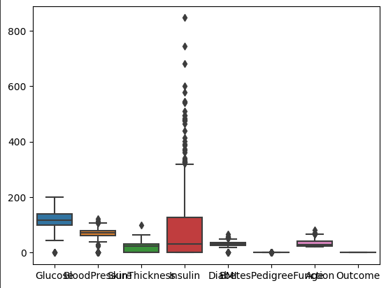
#### After Data Cleaning
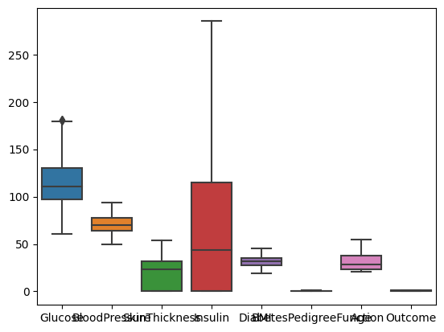
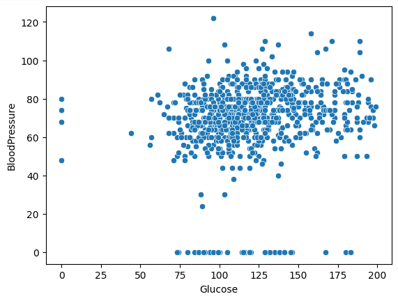
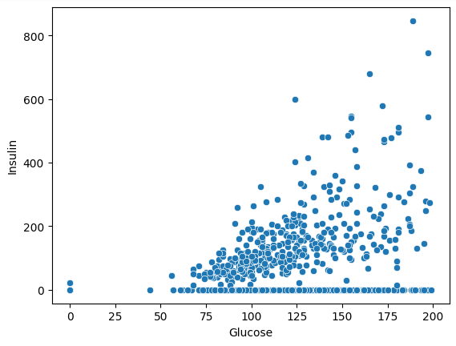
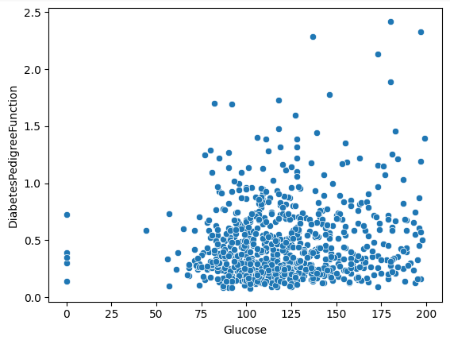
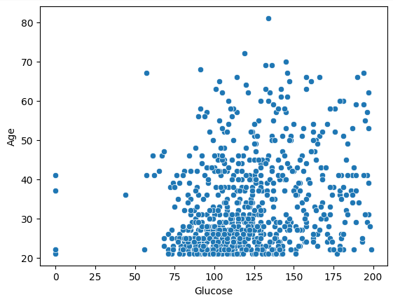
#### Heatmap
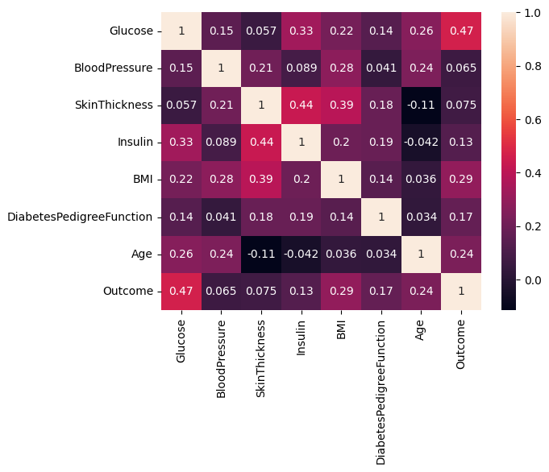<br>
### SuperStore.csv
#### Before Data Cleaning
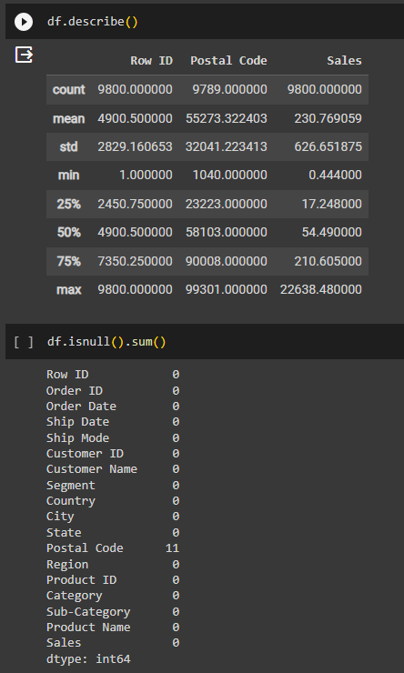
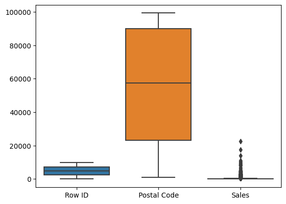
#### After Data Cleaning
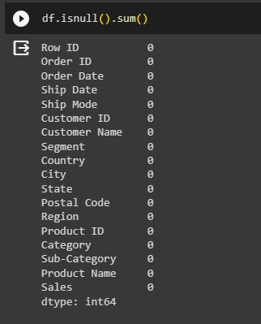
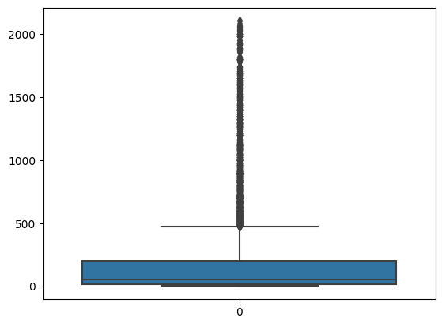
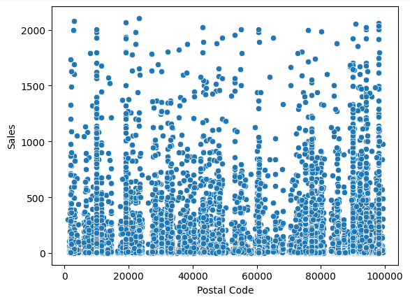
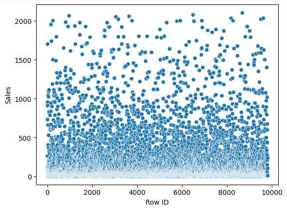
#### Heatmap
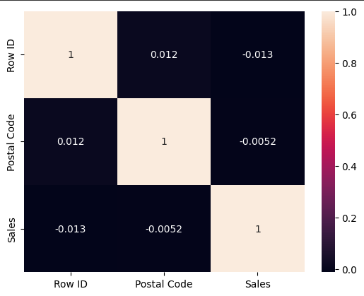
## Result:
### Thus we have read the given data and performed the multivariate analysis with different types of plots.
